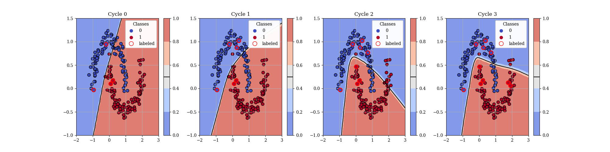
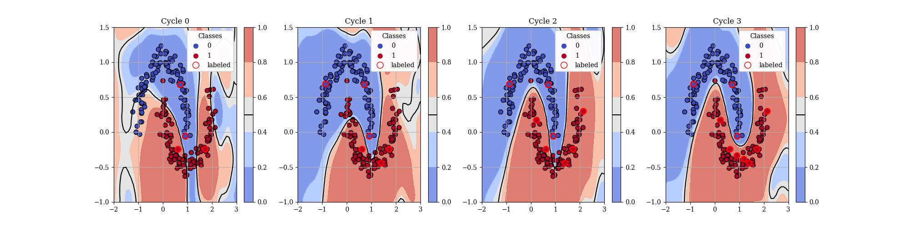

# DAL-Toolbox: A Toolbox for Deep Active Learning
Welcome to DAL-Toolbox, a comprehensive repository designed for implementing various models and strategies in deep active learning (DAL). DAL has garnered significant attention for its potential to reduce the amount of labeled data required to train deep neural networks, the most prominent machine learning model of today. Our toolbox provides a versatile and user-friendly framework for researchers and practitioners to explore and advance the field of DAL. Next to classical supervised DAL, we provide tools regarding semi- and self-supervised learning due to their recent success in improving a model's performance as well as tools regarding improving uncertainty as it plays a central role in querying new data in DAL.

## Setup
Setting up the DAL-Toolbox is straight forward! After cloning the repository, use the following comments to get started:
```
conda create -n dal-toolbox python=3.9
pip install -e .
```

## Code Snippet Illustration
The following code snipped demonstrates a basic usage of the DAL-Toolbox on a two-dimensional toy example:

```python
import torch
import lightning as L
from sklearn.datasets import make_moons
from dal_toolbox.active_learning import ActiveLearningDataModule
from dal_toolbox.models.deterministic import DeterministicModel
from dal_toolbox.active_learning.strategies import LeastConfidentSampling
from dal_toolbox.models.deterministic.simplenet import SimpleNet as Net

# Create the twoo moons dataset
X, y = make_moons(200, noise=.1, random_state=42)
X, y = torch.tensor(X).float(), torch.tensor(y).long()
tensor_dataset = torch.utils.data.TensorDataset(X, y)

# Setup the AL-Datamodule provided by the dal_toolbox and initialize with two randomly labeled samples
al_datamodule = ActiveLearningDataModule(tensor_dataset, train_batch_size=32)
al_datamodule.random_init(n_samples=2, class_balanced=True)
al_strategy = LeastConfidentSampling()

# Initialize a model and wrap it with the DeterministicModel Wrapper provided by the DAL-Toolbox
model = Net(dropout_rate=0., num_classes=2)
model = DeterministicModel(model, optimizer=torch.optim.SGD(model.parameters(), lr=1e-1, momentum=.9))

# Perfom AL-Cycles
for i_cycle in range(4):
    if i_cycle != 0:
        indices = al_strategy.query(model=model, al_datamodule=al_datamodule, acq_size=2)
        al_datamodule.update_annotations(indices)

    model.reset_states()
    trainer = L.Trainer(max_epochs=50, enable_progress_bar=False)
    trainer.fit(model, al_datamodule)
```

Plotting the resulting decision boundaries for each cycle leaves us with



This shows that a simple deterministic model may not have the best uncertainty estimations to provide good features for LeastCertaintySampling. Let's make use of the implemented Spectral Normalized Gaussian Processes (SNGP) to improve the models uncertainty estimations and hopefully solve this task!

```python
from dal_toolbox.models.sngp import SNGPModel
from dal_toolbox.models.deterministic.simplenet import SimpleSNGP as SNGPNet

# Initialize the new sngp model
model2 = SNGPNet(num_classes=2, use_spectral_norm=True, spectral_norm_params=spectral_norm_params, gp_params=gp_params)
model2 = SNGPModel(model2, optimizer=torch.optim.SGD(model.parameters(),  lr=1e-2, weight_decay=1e-2, momentum=.9))

# Setup another datamodule
al_datamodule2 = ActiveLearningDataModule(tensor_dataset, train_batch_size=32)
al_datamodule2.random_init(n_samples=2, class_balanced=True)

# Perfom AL-Cycles
for i_cycle in range(4):
    if i_cycle != 0:
        indices = al_strategy.query(model=model2, al_datamodule=al_datamodule2, acq_size=2)
        al_datamodule2.update_annotations(indices)

    model2.reset_states()
    trainer = L.Trainer(max_epochs=50, enable_progress_bar=False)
    trainer.fit(model2, al_datamodule2)
```

Again, we plot the resulting decision boundaries:



This looks much more promising, demonstrating how improving the uncertainty estimation of a model can have a positive impact on DAL.

Check out [this notebook](/examples/readme_example.ipynb) which contains the code above with some utility functions to produce the decision boundary plots, ready to be adapted to different scenarios!


## Examples
Next to the example above, we provide various examples for each topic mentioned in the description in the [example section](examples/). Each example folder contains two subfolders, a __toy_example__-folder and a __server_experiments__-folder. The toy examples demonstrate each method on a two dimensional dataset and provide a minimal example how to use the respective methods provided by the toolbox. The server experiments contain an examplatory workflow for working on a cluster server with the DAL-Toolbox. Below, we list each example section provided:

### Active Learning
Examples of how to implement an active learning cycle:
- [Standard Active Learning](examples/active_learning/toy_examples/deterministic.ipynb)
- [Bayesian Active Learning](examples/active_learning/toy_examples/mc-dropout.ipynb)

### Self-Supervised Learning
Examples of how to train models with self-supervised learning algorithms:
- [SimCLR](examples/self_supervised_learning/toy_examples/simclr.ipynb)

### Semi-Supervised Learning
Examples of how to train models with semi-supervised learning algorithms:
- [Pseudo-Labeling](examples/semi_supervised_learning/toy_examples/pseudo_labels.ipynb)
- [Pi-Model](examples/semi_supervised_learning/toy_examples/pimodel.ipynb)
- [FixMatch](examples/semi_supervised_learning/toy_examples/fixmatch.ipynb)

### Uncertainty
Examples of how to train models with improved uncertainty estimation:
- [Deterministic](examples/uncertainty/toy_examples/deterministic.ipynb)
- [Ensemble](examples/uncertainty/toy_examples/ensemble.ipynb)
- [MC-Dropout](examples/uncertainty/toy_examples/mc-dropout.ipynb)
- [SNGP](examples/uncertainty/toy_examples/sngp.ipynb)


## Query Strategies
The DAL-Toolbox contains various query strategies ready to be used. The following list shows popular available strategies with a reference to the original papers.

| **Query Strategy** | **Publication**                                                                                                                                              |
|--------------------|--------------------------------------------------------------------------------------------------------------------------------------------------------------|
| BADGE              | [Deep Batch Active Learning by Diverse, Uncertain Gradient Lower Bounds](https://arxiv.org/abs/1906.03671#)                                                  |
| BAIT               | [Gone Fishing: Neural Active Learning with Fisher Embeddings](https://proceedings.neurips.cc/paper/2021/hash/4afe044911ed2c247005912512ace23b-Abstract.html) |
| BALD               | [Bayesian active learning for classification and preference learning](https://arxiv.org/abs/1112.5745)                                                       |
| BEMPS              | [Bayesian Estimate of Mean Proper Scores for Diversity-Enhanced Active Learning](https://ieeexplore.ieee.org/abstract/document/10360321)                     |
| CoreSet            | [Active Learning for Convolutional Neural Networks: A Core-Set Approach](https://arxiv.org/abs/1708.00489)                                                   |
| TypiClust          | [Active Learning on a Budget: Opposite Strategies Suit High and Low Budgets](https://arxiv.org/abs/2202.02794)                                               |
| XPAL               | [Toward optimal probabilistic active learning using a Bayesian approach](https://link.springer.com/article/10.1007/s10994-021-05986-9)                       |
| ProbCover          | [Active Learning Through a Covering Lens](https://arxiv.org/abs/2205.11320)                                                                                  |
| CAL                | [Active Learning by Acquiring Contrastive Examples](https://arxiv.org/abs/2109.03764)                                                                        |

In addition, we provide various basic strategies, such as Random, Entropy, LeastCertainy and some variations thereof. Check out [Query Strategies](dal_toolbox/active_learning/strategies/) for a full list.

## Publications
The DAL-Toolbox has already been used for various publications. The respective code for their experiments is stored in the __publications__ folder. This may provide relevant insights for experienced researches and plentiful examples of experimental sections in papers with the respective code. Publications using the DAL-Toolbox are

[[1](publications/hyperparameters_in_al/)] Huseljic, Denis, et al. "Role of Hyperparameters in Deep Active Learning." IAL@PKDD/ECML. 2023.

[[2](publications/bait_approx/)] Huseljic, Denis, et al. "Fast Fishing: Approximating BAIT for Efficient and Scalable Deep Active Image Classification." PKDD/ECML. 2024.

[[3](publications/laplace_updates/)] Herde, Marek, et al. "Fast Bayesian Updates for Deep Learning with a Use Case in Active Learning." arXiv preprint arXiv:2210.06112 (2022).

[[4](publications/aglae)] Rauch, Lukas, et al. "Activeglae: A benchmark for deep active learning with transformers." Joint European Conference on Machine Learning and Knowledge Discovery in Databases. Cham: Springer Nature Switzerland, 2023.

[[5](publications/udal/)] Huseljic, Denis, et al. "The Interplay of Uncertainty Modeling and Deep Active Learning: An Empirical Analysis in Image Classification." Transactions on Machine Learning Research.


## Citation
If you find the DAL-Toolbox useful for your research, consider citing us using the following BibTex-citation

```
@article{huseljicinterplay,
  title={The Interplay of Uncertainty Modeling and Deep Active Learning: An Empirical Analysis in Image Classification},
  author={Huseljic, Denis and Herde, Marek and Nagel, Yannick and Rauch, Lukas and Strimaitis, Paulius and Sick, Bernhard},
  journal={Transactions on Machine Learning Research}
}
```