# Active Learning Baselines

## Installation

First install all dependencies of `dal-toolbox`, which are located [here](../../requirements.txt).
Then install the requirements specified in [requirements.txt](requirements.txt)

## Training baselines

To train a model simply run: `python active_learning.py`

This will use the standard hyperparameters specified in [configs/active_learning.yaml](configs/active_learning.yaml).
You can change these parameters either by adjusting the config file, or passing different parameters to run, e.g. `python active_learning.py model=YOUR_MODEL`.

### Hyperparameters

| Argument                 | Standard Parameter       | Description                                                                             |
|--------------------------|--------------------------|-----------------------------------------------------------------------------------------|
| `model`                  | `resnet18_deterministic` | The model to train. Overview found [here](#models)                                      |
| `dataset`                | `CIFAR10`                | The dataset to use. Overview found [here](#datasets)                                    |
| `al_strategy`            | `random`                 | The active learning strategy to use. Overview found [here](#active-learning-strategies) |
| `random_seed`            | `42`                     | The random seed for reproducibility.                                                    |
| `val_interval`           | `25`                     | Every `val_interval` epochs the validation step is done.                                |
| `dataset_path`           | `./data/`                | The directory were the datasets are stored/downloaded.                                  |
| `output_dir`             | `./output/`              | The directory where the results/logs/checkpoints are saved to.                          |
| `al_cycle.n_init`        | `100`                    | How many samples are in the initial labeled set.                                        |
| `al_cycle.acq_size`      | `100`                    | How many samples are queried in each AL cycle.                                          |
| `al_cycle.n_acq`         | `9`                      | How many AL cycles to train.                                                            |
| `al_cycle.cold_start`    | `True`                   | Whether to reset the model in each AL cycle.                                            |
| `al_cycle.init_strategy` | `random`                 | How the samples in the initial labeled set are determined. Can be any AL strategy.      |

It is also possible to use precomputed features (e.g. from a self-supervised task) for training.
See [Using precomputed features](#using-precomputed-features) for more details.

#### Models

The following models are implemented:

| Model                          | Argument                       |
|--------------------------------|--------------------------------|
| ResNet18 [[1](#sources)]       | `resnet18_deterministic`       |
| WideResNet2810 [[9](#sources)] | `wideresnet2810_deterministic` |

Furthermore, the following hyperparameters can be adjusted for each model:

| Argument                       | Description                                                       |
|--------------------------------|-------------------------------------------------------------------|
| `model.name`                   | The name of the model.                                            |
| `model.num_epochs`             | How many epochs the model should be trained for in each AL cycle. |
| `model.train_batch_size`       | The batch size for training.                                      |
| `model.predict_batch_size`     | The batch size for validation/testing.                            |
| `model.optimizer.lr`           | The learning rate for training.                                   |
| `model.optimizer.weight_decay` | The weight decay for training.                                    |
| `model.optimizer.momentum`     | The momentum for training.                                        |

The standard parameters depend on each specific model and can be found in their respective config file.
(For example, the config for the ResNet18 con be found in [configs/model/resnet18.yaml](configs/model/resnet18.yaml).)
In addition, there are some hyperparameters, that 

#### Datasets

The following datasets are implemented:

| Dataset                     | Argument      |
|-----------------------------|---------------|
| CIFAR10 [[2](#sources)]     | `CIFAR10`     |
| CIFAR100 [[2](#sources)]    | `CIFAR100`    |
| SVHN  [[3](#sources)]       | `SVHN`        |
| ImageNet [[7](#sources)]    | `ImageNet`    |
| ImageNet50 [[8](#sources)]  | `ImageNet50`  |
| ImageNet100 [[8](#sources)] | `ImageNet100` |
| ImageNet200 [[8](#sources)] | `ImageNet200` |

Keep in mind that ImageNet and its subsets are not automatically downloaded and have to be downloaded manually (See https://image-net.org/).

#### Active learning strategies

The following active learning strategies are implemented:

| Strategy                  | Argument    |
|---------------------------|-------------|
| Random sampling           | `random`    |
| Entropy sampling          | `entropy`   |
| Core-Set [[4](#sources)]  | `coreset`   |
| BADGE [[5](#sources)]     | `badge`     |
| TypiClust [[6](#sources)] | `typiclust` |

For TypiClust to work, [pandas](https://pandas.pydata.org/) has to be installed.
Furthermore, the following hyperparameters can be adjusted for each active learning strategy:

| Argument                  | Standard Parameter | Description                                                                                                                                       |
|---------------------------|--------------------|---------------------------------------------------------------------------------------------------------------------------------------------------|
| `al_strategy.subset_size` | `10000`            | How many unlabeled samples the strategy considers in each AL cycle. These samples are chosen randomly from the whole unlabeled set in each cycle. |

#### Using precomputed features

Instead of using a normal dataset one can use precomputed features to train on.
(The `dataset` parameter will then be ignored.)
This setting can be enabled with by setting the parameter `precomputed_features` to `True`.
Here the directory where the saved features are has to be specified with `precomputed_features_dir`.
This has to be a dictionary with three fields: `trainset` and `testset`.

The `model` parameter has to be set to `linear`, which will result in a linear layer, which will be trained on the precomputed features.

## Comparison with state-of-the-art

## Complete overview

Here we see an overview of all baseline experiments performed.
All slurm scripts used to run these experiments can be found [here](../../experiments/active_learning/slurm/ynagel).

| Dataset  | Model    | Budget 1000                                                              | Budget 2500                                                              | Budget 5000                                                              | Budget 10000                                                              |
|----------|----------|--------------------------------------------------------------------------|--------------------------------------------------------------------------|--------------------------------------------------------------------------|---------------------------------------------------------------------------|
| CIFAR10  | ResNet18 | 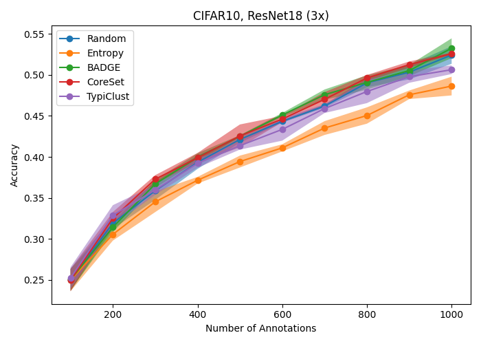  | 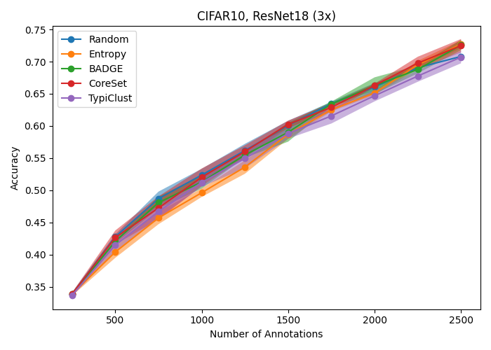  | 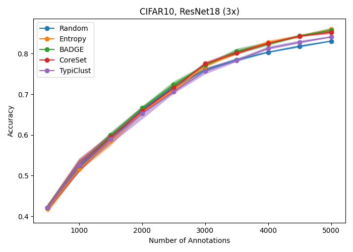  | 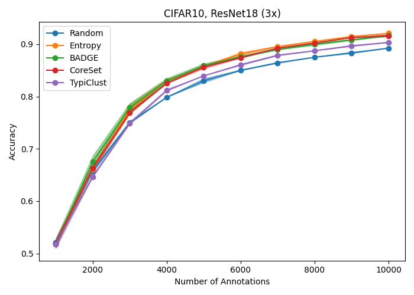  |
| CIFAR100 | ResNet18 | 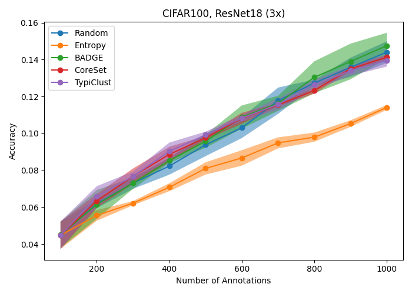 | 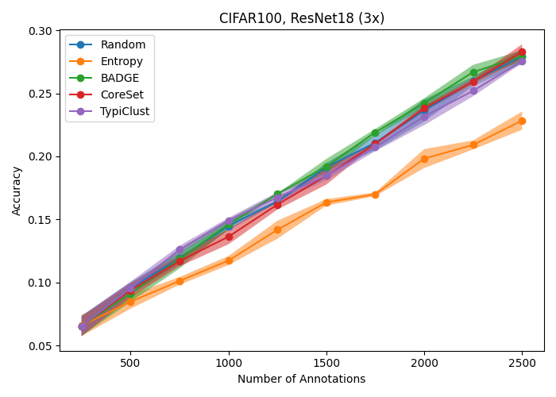 | 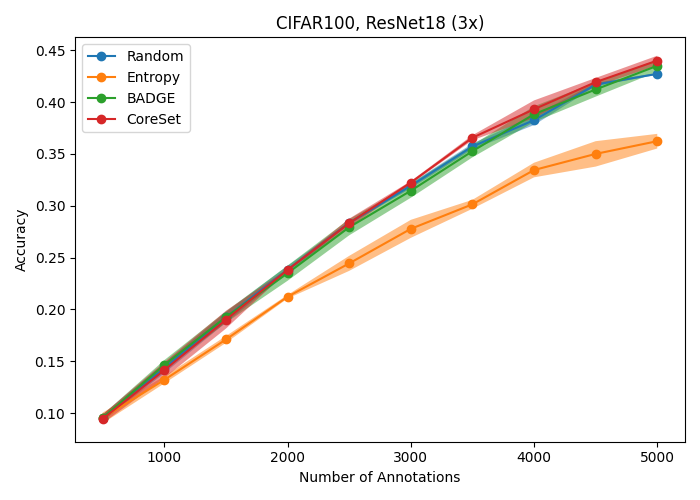 | 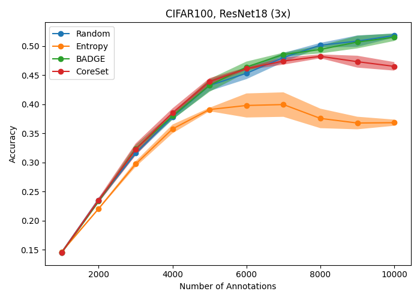 |
| SVHN     | ResNet18 | 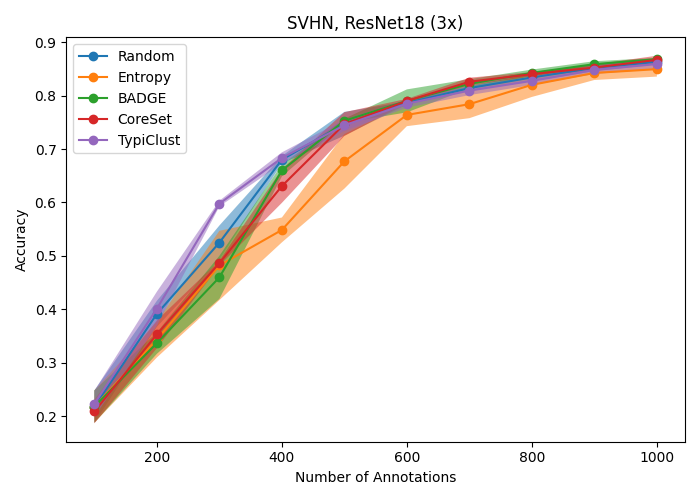     | 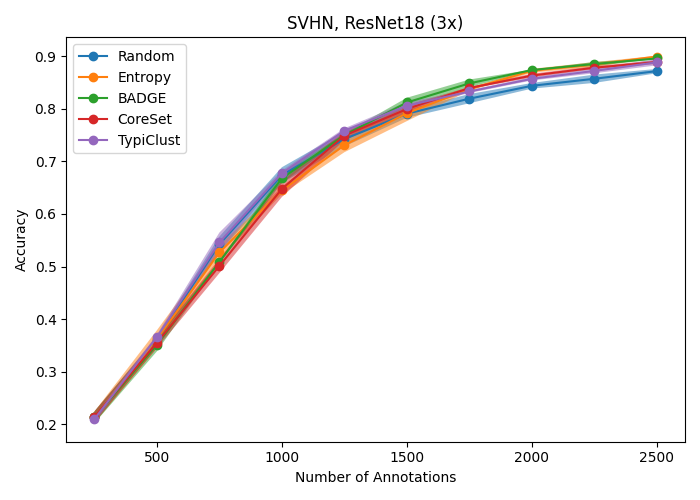     | 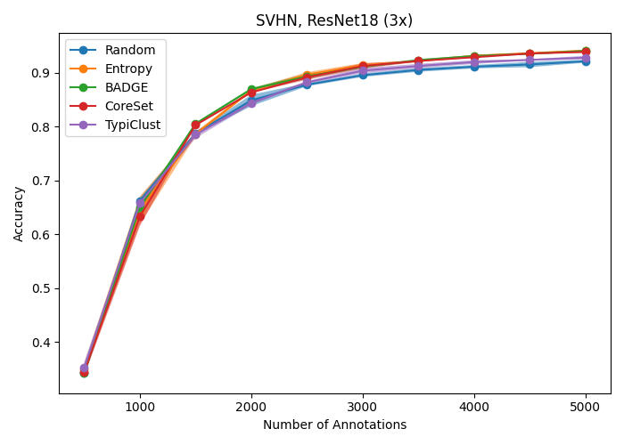     | 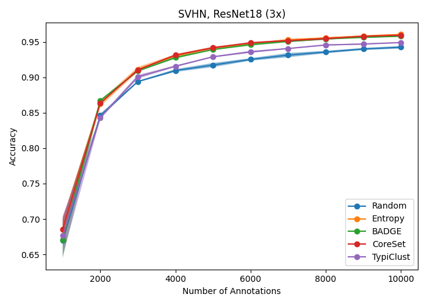     |

TypiClust might not work for high budgets, since there might not be enough uncovered clusters.
Therefore, the `subset_size` parameter was set to 30000 for all TypiClust experiments.
Furthermore, TypiClust was not used in CIFAR100 experiments with budget 5000 and 10000 for the same reasoning.

### Experiments with precomputed features

| Dataset | Model  | Budget 60                                                           | Budget 200                                                           |
|---------|--------|---------------------------------------------------------------------|----------------------------------------------------------------------|
| CIFAR10 | Linear | 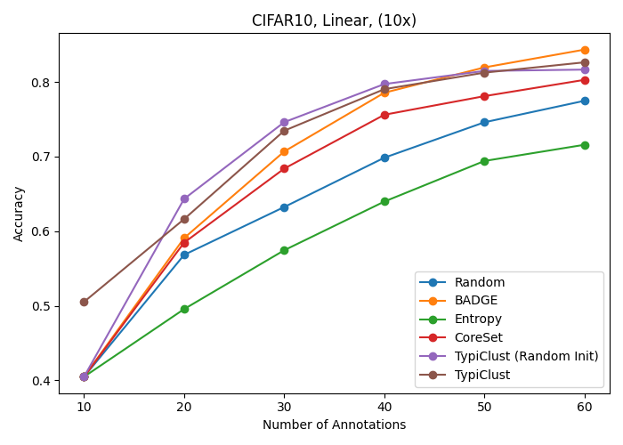 | 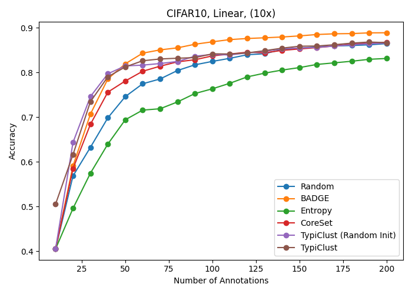 |
| SVHN    | Linear | 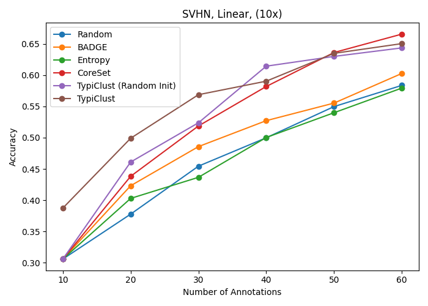    | 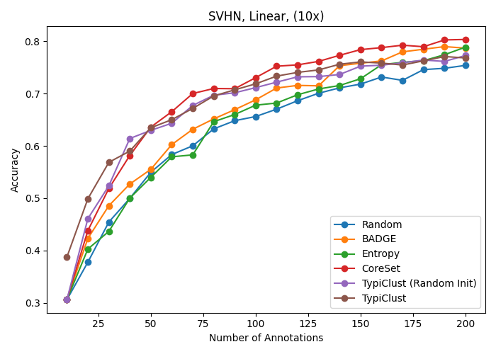    |

## Sources

- [1] He, Kaiming, Xiangyu Zhang, Shaoqing Ren, and Jian Sun. “Deep Residual Learning for Image Recognition.” In Proceedings of the IEEE Conference on Computer Vision and Pattern Recognition, 770–78, 2016.
- [2] Krizhevsky, Alex. “Learning Multiple Layers of Features from Tiny Images.” (2009).
- [3] Netzer, Yuval, Tao Wang, Adam Coates, Alessandro Bissacco, Bo Wu, and Andrew Y. Ng. “Reading Digits in Natural Images with Unsupervised Feature Learning,.” In Deep Learning Unsupervised Feature Learn. Workshop @ Adv. Neural. Inf. Process. Syst. Granada, Spain, 2011.
- [4] Sener, Ozan, and Silvio Savarese. “Active Learning for Convolutional Neural Networks: A Core-Set Approach.” In International Conference on Learning Representations, 2018. https://openreview.net/forum?id=H1aIuk-RW.
- [5] Ash, Jordan T., Chicheng Zhang, Akshay Krishnamurthy, John Langford, and Alekh Agarwal. “Deep Batch Active Learning by Diverse, Uncertain Gradient Lower Bounds.” In International Conference on Learning Representations, 2020. https://openreview.net/forum?id=ryghZJBKPS.
- [6] Hacohen, Guy, Avihu Dekel, and Daphna Weinshall. “Active Learning on a Budget: Opposite Strategies Suit High and Low Budgets.” In International Conference on Machine Learning, 8175–95. PMLR, 2022. http://arxiv.org/abs/2202.02794.
- [7] Deng, Jia, Wei Dong, Richard Socher, Li-Jia Li, Kai Li, and Li Fei-Fei. “ImageNet: A Large-Scale Hierarchical Image Database.” In 2009 IEEE Conference on Computer Vision and Pattern Recognition, 248–55. Miami, USA: IEEE, 2009. https://doi.org/10.1109/CVPR.2009.5206848.
- [8] Van Gansbeke, Wouter, Simon Vandenhende, Stamatios Georgoulis, Marc Proesmans, and Luc Van Gool. “SCAN: Learning to Classify Images without Labels.” In Computer Vision -- ECCV 2020, 12355:268–85. Lecture Notes in Computer Science. Glasgow, UK: Springer International Publishing, 2020. https://doi.org/10.1007/978-3-030-58607-2_16.
- [9] Zagoruyko, Sergey, and Nikos Komodakis. “Wide Residual Networks.” In Proceedings of the British Machine Vision Conference 2016, 87.1-87.12. York, United Kingdom: BMVA, 2016. https://doi.org/10.5244/C.30.87.

