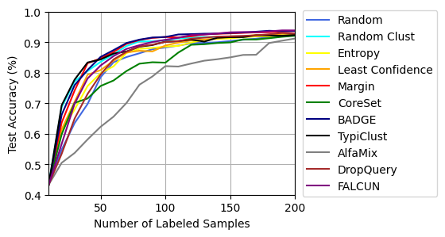
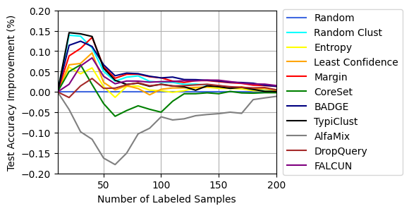
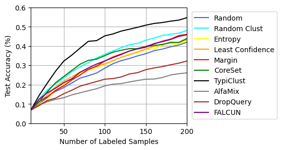
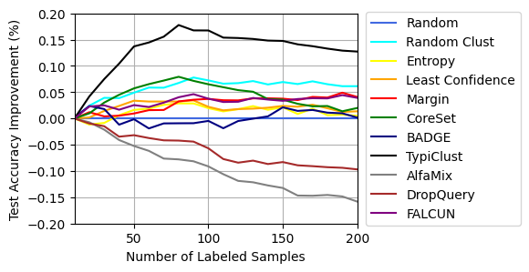
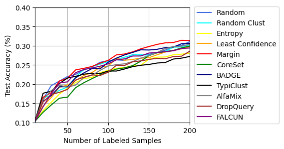
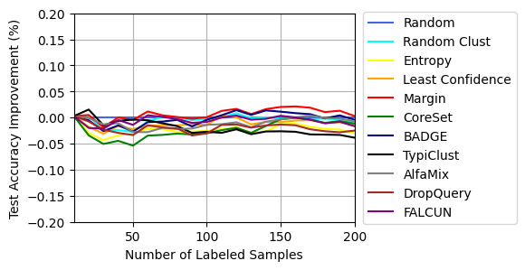

# Active Learning Baselines

## Installation

First install all dependencies of `dal-toolbox`, which are located [here](../../requirements.txt).
Then install the requirements specified in [requirements.txt](requirements.txt)

## Training baselines

To train a model simply run: `python active_learning.py`

This will use the standard hyperparameters specified in [configs/active_learning.yaml](configs/active_learning.yaml).
You can change these parameters either by adjusting the config file, or passing different parameters to run, e.g. `python active_learning.py model=YOUR_MODEL`.

### Hyperparameters

| Argument                 | Standard Parameter       | Description                                                                             |
|--------------------------|--------------------------|-----------------------------------------------------------------------------------------|
| `model`                  | `resnet18` | The model to train. Overview found [here](#models)                                      |
| `dataset`                | `CIFAR10`                | The dataset to use. Overview found [here](#datasets)                                    |
| `al_strategy`            | `random`                 | The active learning strategy to use. Overview found [here](#active-learning-strategies) |
| `random_seed`            | `42`                     | The random seed for reproducibility.                                                    |
| `val_interval`           | `25`                     | Every `val_interval` epochs the validation step is done.                                |
| `path.data_dir`           | `./data/`                | The directory were the datasets are stored/downloaded.                                  |
| `path.output_dir`             | `./output/`              | The directory where the results/logs/checkpoints are saved to.                          |
| `path.cache_dir`          | `./cache/`                | Where precomputed features of a foundation model will be saved to.                    |
| `al_cycle.n_init`        | `100`                    | How many samples are in the initial labeled set.                                        |
| `al_cycle.acq_size`      | `100`                    | How many samples are queried in each AL cycle.                                          |
| `al_cycle.n_acq`         | `9`                      | How many AL cycles to train.                                                            |
| `al_cycle.cold_start`    | `True`                   | Whether to reset the model in each AL cycle.                                            |
| `al_cycle.init_strategy` | `random`                 | How the samples in the initial labeled set are determined. Can be any AL strategy.      |

It is also possible to use precomputed features (e.g. from a self-supervised task) for training. This can primarly be set by choosing `model=dinov2`.

#### Models

The following models are implemented:

| Model                          | Argument                       |
|--------------------------------|--------------------------------|
| ResNet18 [[1](#sources)]       | `resnet18`                     |
| DinoV2 [[9](#sources)]         | `dinov2`                       |

Furthermore, the following hyperparameters can be adjusted for each model:

| Argument                       | Description                                                       |
|--------------------------------|-------------------------------------------------------------------|
| `model.name`                   | The name of the model.                                            |
| `model.num_epochs`             | How many epochs the model should be trained for in each AL cycle. |
| `model.train_batch_size`       | The batch size for training.                                      |
| `model.predict_batch_size`     | The batch size for validation/testing.                            |
| `model.optimizer.lr`           | The learning rate for training.                                   |
| `model.optimizer.weight_decay` | The weight decay for training.                                    |
| `model.optimizer.momentum`     | The momentum for training.                                        |

The standard parameters depend on each specific model and can be found in their respective config file.
(For example, the config for the ResNet18 con be found in [configs/model/resnet18.yaml](configs/model/resnet18.yaml).)

#### Datasets

The following datasets are implemented:

| Dataset                     | Argument      |
|-----------------------------|---------------|
| CIFAR10 [[2](#sources)]     | `CIFAR10`     |
| CIFAR100 [[2](#sources)]    | `CIFAR100`    |
| SVHN  [[3](#sources)]       | `SVHN`        |
| ImageNet [[7](#sources)]    | `ImageNet`    | ?
| ImageNet50 [[8](#sources)]  | `ImageNet50`  | ?
| ImageNet100 [[8](#sources)] | `ImageNet100` | ?
| ImageNet200 [[8](#sources)] | `ImageNet200` | ?

Keep in mind that ImageNet and its subsets are not automatically downloaded and have to be downloaded manually (See https://image-net.org/).

#### Active learning strategies

The following active learning strategies are implemented:

| Strategy                  | Argument    |
|---------------------------|-------------|
| Random sampling           | `random`    |
| Entropy sampling          | `entropy`   |
| Margin sampling           | `margin` |
| Least Confidence sampling | 'leastconfidence' |
| Random Clust Sampling     | 'randomclust'|
| Core-Set [[4](#sources)]  | `coreset`   |
| BADGE [[5](#sources)]     | `badge`     |
| TypiClust [[6](#sources)] | `typiclust` |
| AlfaMix [[10](#sources)]   | `alfamix` |
| DropQuery [[12](#sources)] | `dropquery`|
| Falcun [[11](#sources)]    | `falcun` |

Furthermore, for each strategy, the hyperparameter `al_strategy.subset_size` can be adjusted, determining how many unlabeled samples the strategy considers in each AL cycle. These samples are chosen randomly from the whole unlabeled set in each cycle. It does improve efficiency of the querying process but at the cost of potentially missing valuable unlabeled datapoints.

## Comparison with state-of-the-art

## Complete overview

Here we see an overview of all baseline experiments performed.
All slurm scripts used to run these experiments can be found [here](slurm/).

| Dataset   | Model  | Absolute Performance                                                    | Relative Performance                                                    |
|---------  |--------|-------------------------------------------------------------------------|-------------------------------------------------------------------------|
| CIFAR10   | DinoV2 |                                 |                           |
| CIFAR100 | DinoV2 |                                 |                          |
| SVHN      | DinoV2 |                                 |                                 |

## Sources

- [1] He, Kaiming, Xiangyu Zhang, Shaoqing Ren, and Jian Sun. “Deep Residual Learning for Image Recognition.” In Proceedings of the IEEE Conference on Computer Vision and Pattern Recognition, 770–78, 2016.
- [2] Krizhevsky, Alex. “Learning Multiple Layers of Features from Tiny Images.” (2009).
- [3] Netzer, Yuval, Tao Wang, Adam Coates, Alessandro Bissacco, Bo Wu, and Andrew Y. Ng. “Reading Digits in Natural Images with Unsupervised Feature Learning,.” In Deep Learning Unsupervised Feature Learn. Workshop @ Adv. Neural. Inf. Process. Syst. Granada, Spain, 2011.
- [4] Sener, Ozan, and Silvio Savarese. “Active Learning for Convolutional Neural Networks: A Core-Set Approach.” In International Conference on Learning Representations, 2018. https://openreview.net/forum?id=H1aIuk-RW.
- [5] Ash, Jordan T., Chicheng Zhang, Akshay Krishnamurthy, John Langford, and Alekh Agarwal. “Deep Batch Active Learning by Diverse, Uncertain Gradient Lower Bounds.” In International Conference on Learning Representations, 2020. https://openreview.net/forum?id=ryghZJBKPS.
- [6] Hacohen, Guy, Avihu Dekel, and Daphna Weinshall. “Active Learning on a Budget: Opposite Strategies Suit High and Low Budgets.” In International Conference on Machine Learning, 8175–95. PMLR, 2022. http://arxiv.org/abs/2202.02794.
- [7] Deng, Jia, Wei Dong, Richard Socher, Li-Jia Li, Kai Li, and Li Fei-Fei. “ImageNet: A Large-Scale Hierarchical Image Database.” In 2009 IEEE Conference on Computer Vision and Pattern Recognition, 248–55. Miami, USA: IEEE, 2009. https://doi.org/10.1109/CVPR.2009.5206848.
- [8] Van Gansbeke, Wouter, Simon Vandenhende, Stamatios Georgoulis, Marc Proesmans, and Luc Van Gool. “SCAN: Learning to Classify Images without Labels.” In Computer Vision -- ECCV 2020, 12355:268–85. Lecture Notes in Computer Science. Glasgow, UK: Springer International Publishing, 2020. https://doi.org/10.1007/978-3-030-58607-2_16.
- [9] Zagoruyko, Sergey, and Nikos Komodakis. “Wide Residual Networks.” In Proceedings of the British Machine Vision Conference 2016, 87.1-87.12. York, United Kingdom: BMVA, 2016. https://doi.org/10.5244/C.30.87.
- [10] Parvaneh, A., Abbasnejad, E., Teney, D., Haffari, G. R., Van Den Hengel, A., & Shi, J. Q. (2022). Active learning by feature mixing. In Proceedings of the IEEE/CVF conference on computer vision and pattern recognition (pp. 12237-12246).
- [11] Gilhuber, S., Beer, A., Ma, Y., & Seidl, T. (2024, August). FALCUN: A Simple and Efficient Deep Active Learning Strategy. In Joint European Conference on Machine Learning and Knowledge Discovery in Databases (pp. 421-439). Cham: Springer Nature Switzerland.
- [12] S. R. Gupte, J. Aklilu, J. J. Nirschl, S. Yeung-Levy, Revisiting active learning in the era of vision foundation models, Transactions on Machine Learning Research (2024). URL: https://openreview.net/forum?id=u8K83M9mbG.
. [13] Maxime Oquab, Timothée Darcet, Théo Moutakanni, Huy Vo, Marc Szafraniec, Vasil Khalidov, Pierre Fernandez, Daniel Haziza, Francisco Massa, Alaaeldin El-Nouby, et al. Dinov2: Learning robust visual features without supervision. arXiv preprint arXiv:2304.07193, 2023.