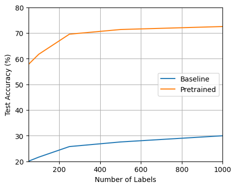
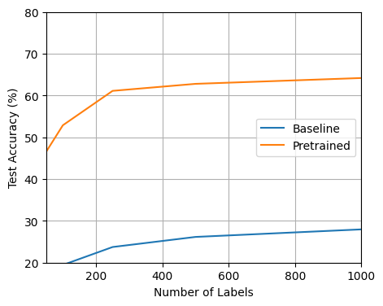
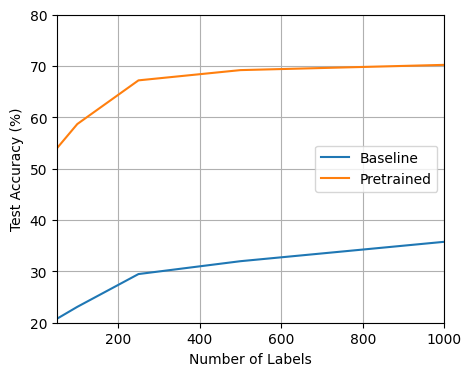

# Self-Supervised Server Experiment

## Installation

First create a virtual environment with `python >= 3.9`.
Then install the `dal-toolbox` with `pip install -e .` on the highest folder level.
Finally install any additional requirements placed in [requirements.txt](requirements.txt) with `pip install -r requirements.txt`.

## Usage

To pretrain a model simply run: `python pretrain.py`
Subsequently, you can evaluate the learned features using `python finetune.py`

This will use the standard hyperparameters specified in [configs/config.yaml](configs/config.yaml).
You can change these parameters either by adjusting the config file, or passing different parameters to run, e.g. `python pretrain.py model=YOUR_MODEL`.

## Hyperparameters

| Argument                 | Standard Parameter       | Description                                                                             |
|--------------------------|--------------------------|-----------------------------------------------------------------------------------------|
| `model`                  | `resnet18` | The model to train. Overview found [here](#models)                                      |
| `dataset`                | `CIFAR10`                | The dataset to use. Overview found [here](#datasets)                                    |
| `al_strategy`            | `random`                 | The active learning strategy to use. Overview found [here](#active-learning-strategies) |
| `random_seed`            | `42`                     | The random seed for reproducibility.                                                    |
| `val_interval`           | `25`                     | Every `val_interval` epochs the validation step is done.                                |
| `pretrained_weights_path`| `./weights/`                | The directory were the the weights of the model will be stored after pretraining.    |
| `load_pretrained_weights`| `False`              | Decides wether pretrained weights will be loaded for finetuning.                          |

It is essential to use the same pretrained_weights_path for pretraining and finetuning to ensure the pretrained weights are used!

## Models

The following models are implemented:

| Model                          | Argument                       |
|--------------------------------|--------------------------------|
| ResNet18 [[1](#sources)]       | `resnet18`                     |
| WideResNet282 [[3](#sources)]         | `wideresnet282`         |
| WideResNet2810 [[3](#sources)]         | `wideresnet2810`       |

Furthermore, the following hyperparameters can be adjusted for each model:

| Argument                       | Description                                                       |
|--------------------------------|-------------------------------------------------------------------|
| `model.num_epochs`             | How many epochs the model should be trained for in each AL cycle. |
| `model.train_batch_size`       | The batch size for training.                                      |
| `model.predict_batch_size`     | The batch size for validation/testing.                            |
| `model.optimizer.lr`           | The learning rate for training.                                   |
| `model.optimizer.weight_decay` | The weight decay for training.                                    |
| `model.optimizer.momentum`     | The momentum for training.                                        |

The standard parameters depend on each specific model and can be found in their respective config file.
(For example, the config for the ResNet18 con be found in [configs/model/resnet18.yaml](configs/model/resnet18.yaml).)

## Datasets

The following datasets are implemented:

| Dataset                     | Argument      |
|-----------------------------|---------------|
| CIFAR10 [[2](#sources)]     | `CIFAR10`     |

## Self-Supervised Learning Algorithm

Currently, only SimCLR [[4](#sources)] is supported by this repository as a Self-Supervised Learning algorithm.

## Baseline Results

Here we see an overview of all baseline experiments performed.
All slurm scripts used to run these experiments can be found [here](slurm/).

| Dataset   | Model            | Absolute Performance                                     |
|---------  |------------------|----------------------------------------------------------|
| CIFAR10   | ResNet-18        |                         | 
| CIFAR10   | WideResNet-28-2  |                    | 
| CIFAR10   | WideResNet-28-10 |                   |

## Sources

- [1] He, Kaiming, Xiangyu Zhang, Shaoqing Ren, and Jian Sun. “Deep Residual Learning for Image Recognition.” In Proceedings of the IEEE Conference on Computer Vision and Pattern Recognition, 770–78, 2016.
- [2] Krizhevsky, Alex. “Learning Multiple Layers of Features from Tiny Images.” (2009).
- [3] Zagoruyko, Sergey. "Wide residual networks." arXiv preprint arXiv:1605.07146 (2016).
- [4] Falcon, William, and Kyunghyun Cho. "A framework for contrastive self-supervised learning and designing a new approach." arXiv preprint arXiv:2009.00104 (2020).