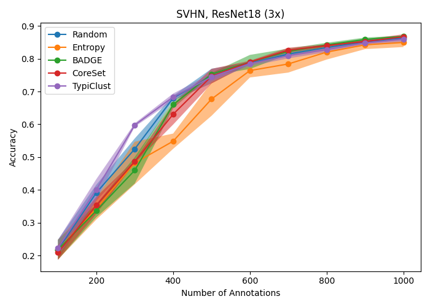
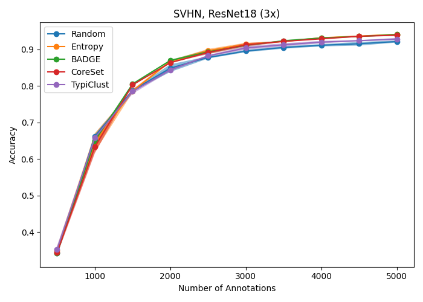

# Active Learning Baselines

## Training baselines

To train a model simply run: `python active_learning.py`

This will use the hyperparameters specified in [configs/active_learning.yaml](configs/active_learning.yaml).
You can change these parameters either by adjusting the config file, or passing different parameters to run: `python active_learning.py model=YOUR_MODEL`

### Hyperparameters

| Argument | Standard Parameter       | Description         |
|----------|--------------------------|---------------------|
| `model`  | `resnet18_deterministic` | The model to train. |

## Comparison with state-of-the-art

## Complete overview

Here we see an overview of all baseline experiments performed.
All slurm scripts used to run these experiments can be found [here](slurm/ynagel).

| Dataset  | Model    | Budget 1000                                                              | Budget 2500                                                              | Budget 5000                                                              | Budget 10000                                                              |
|----------|----------|--------------------------------------------------------------------------|--------------------------------------------------------------------------|--------------------------------------------------------------------------|---------------------------------------------------------------------------|
| CIFAR10  | ResNet18 |   |   |   |   |
| CIFAR100 | ResNet18 |  |  |  |  |
| SVHN     | ResNet18 |      |      |      |      |

## TO-DO's

- Installation details in main README currently do not suffice to run the baseline experiments.
- Complete list of hyperparameters to run script.
- SVHN Budget 1000 uses more optimized hyperparameters than the other budgets, leading to performance discrepancies.
- Implement/test more strategies and models
- Complete overview images are small and have to be clicked on see in detail