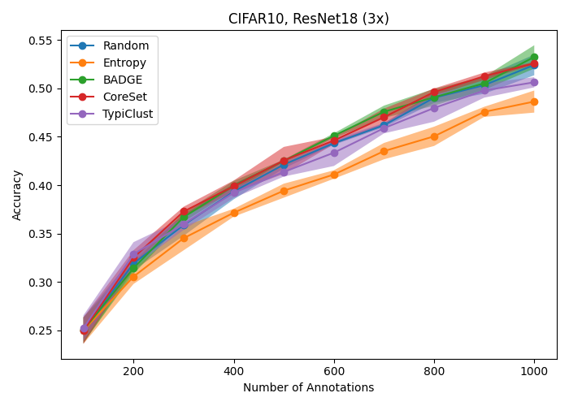

# Active Learning Baselines

## Training baselines

To train a model simply run: `python active_learning.py`

This will use the hyperparameters specified in [configs/active_learning.yaml](configs/active_learning.yaml).
You can change these parameters either by adjusting the config file, or passing different parameters to run: `python active_learning.py model=YOUR_MODEL`

### Hyperparameters

| Argument      | Standard Parameter       | Description                                                                             |
|---------------|--------------------------|-----------------------------------------------------------------------------------------|
| `model`       | `resnet18_deterministic` | The model to train. Overview found [here](#models)                                      |
| `dataset`     | `CIFAR10`                | The dataset to use. Overview found [here](#datasets)                                    |
| `al_strategy` | `random`                 | The active learning strategy to use. Overview found [here](#active-learning-strategies) |

#### Models

The following models are implemented:

| Model                    | Argument                 |
|--------------------------|--------------------------|
| ResNet18 [[1](#sources)] | `resnet18_deterministic` |

### Datasets

The following datasets are implemented:

| Dataset                  | Argument   |
|--------------------------|------------|
| CIFAR10 [[2](#sources)]  | `CIFAR10`  |
| CIFAR100 [[2](#sources)] | `CIFAR100` |
| SVHN  [[3](#sources)]    | `SVHN`     |

### Active learning strategies

The following active learning strategies are implemented:

| Strategy                 | Argument  |
|--------------------------|-----------|
| Random sampling          | `random`  |
| Entropy sampling         | `entropy` |
| Core-Set [[4](#sources)] | `coreset` |
| BADGE [[5](#sources)]    | `badge`   |

## Comparison with state-of-the-art

## Complete overview

Here we see an overview of all baseline experiments performed.
All slurm scripts used to run these experiments can be found [here](slurm/ynagel).

| Dataset  | Model    | Budget 1000                                                              | Budget 2500                                                              | Budget 5000                                                              | Budget 10000                                                              |
|----------|----------|--------------------------------------------------------------------------|--------------------------------------------------------------------------|--------------------------------------------------------------------------|---------------------------------------------------------------------------|
| CIFAR10  | ResNet18 |   |   |   |   |
| CIFAR100 | ResNet18 |  |  |  |  |
| SVHN     | ResNet18 |      |      |      |      |

## TO-DO's

- Installation details in main README currently do not suffice to run the baseline experiments.
- Complete list of hyperparameters to run script.
- SVHN Budget 1000 uses more optimized hyperparameters than the other budgets, leading to performance discrepancies.
- Implement/test more strategies and models
- Complete overview images are small and have to be clicked on see in detail

## Sources

- [1] He, Kaiming, Xiangyu Zhang, Shaoqing Ren, and Jian Sun. “Deep Residual Learning for Image Recognition.” In Proceedings of the IEEE Conference on Computer Vision and Pattern Recognition, 770–78, 2016.
- [2] Krizhevsky, Alex. “Learning Multiple Layers of Features from Tiny Images.” (2009).
- [3] Netzer, Yuval, Tao Wang, Adam Coates, Alessandro Bissacco, Bo Wu, and Andrew Y. Ng. “Reading Digits in Natural Images with Unsupervised Feature Learning,.” In Deep Learning Unsupervised Feature Learn. Workshop @ Adv. Neural. Inf. Process. Syst. Granada, Spain, 2011.
- [4] Sener, Ozan, and Silvio Savarese. “Active Learning for Convolutional Neural Networks: A Core-Set Approach.” In International Conference on Learning Representations, 2018. https://openreview.net/forum?id=H1aIuk-RW.
- [5] Ash, Jordan T., Chicheng Zhang, Akshay Krishnamurthy, John Langford, and Alekh Agarwal. “Deep Batch Active Learning by Diverse, Uncertain Gradient Lower Bounds.” In International Conference on Learning Representations, 2020. https://openreview.net/forum?id=ryghZJBKPS.

