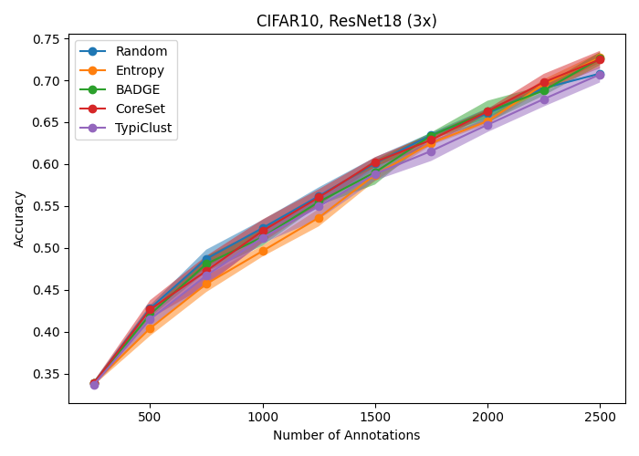
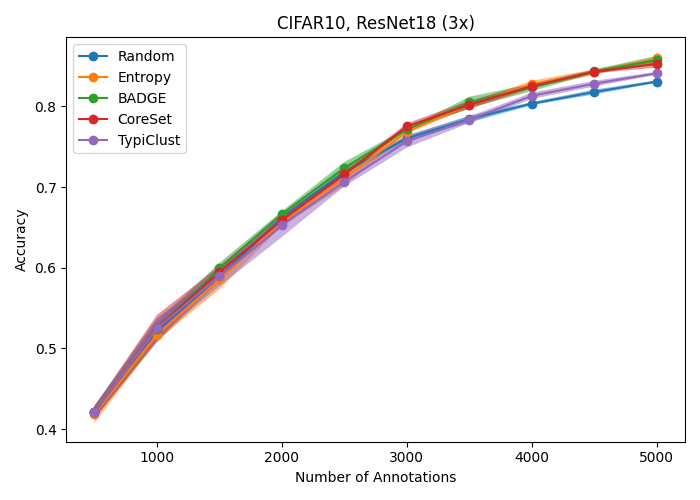
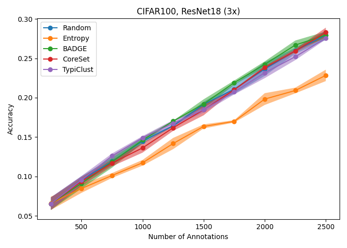
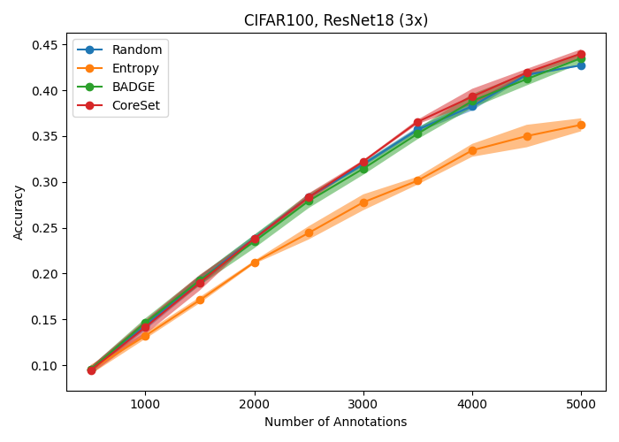
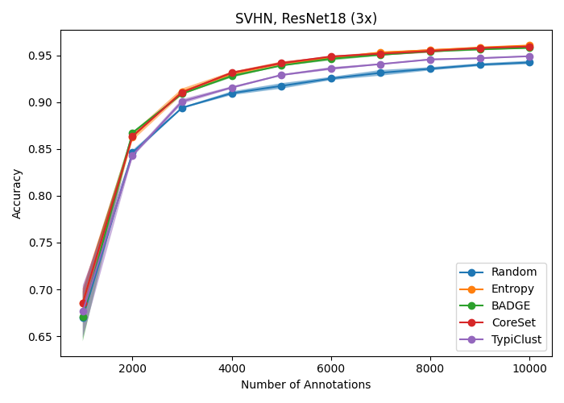

# Active Learning Baselines

## Complete overview

| Dataset  | Model    | Budget 1000                                                              | Budget 2500                                                              | Budget 5000                                                              | Budget 10000                                                              |
|----------|----------|--------------------------------------------------------------------------|--------------------------------------------------------------------------|--------------------------------------------------------------------------|---------------------------------------------------------------------------|
| CIFAR10  | ResNet18 |   |   |   |   |
| CIFAR100 | ResNet18 |  |  |  |  |
| SVHN     | ResNet18 |      |      |      |      |

